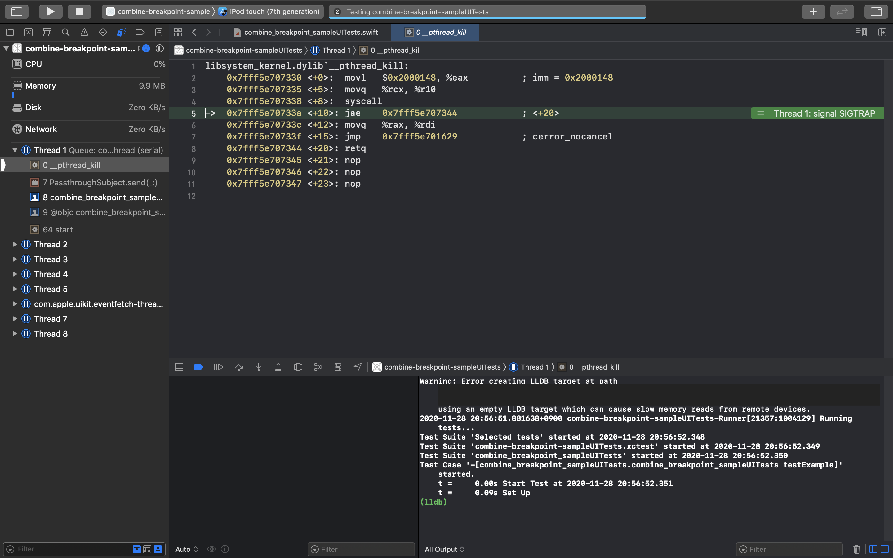

# Publisher.breakpoint(receiveSubscription:receiveOutput:receiveCompletion:)

Set the condition for stopping the process.

## Declaration

```swift
func breakpoint(receiveSubscription: ((Subscription) -> Bool)? = nil, receiveOutput: ((Self.Output) -> Bool)? = nil, receiveCompletion: ((Subscribers.Completion<Self.Failure>) -> Bool)? = nil) -> Publishers.Breakpoint<Self>
```

## Framework

Combine.framework

## Supported OS Version

iOS 13.0~

## Run this Example

Open the Xcode project. And run a test case named `testExample`.

The testing process will stop due to this method, like this:



## Envirionment

| name | Version|
|---|---|
| Swift | 5.3.1 |
| XCode | 12.2 |
| iOS | 13.0〜 |

## Reference

[breakpoint(receiveSubscription:receiveOutput:receiveCompletion:) | Apple Developer Documentation](https://developer.apple.com/documentation/combine/publisher/breakpoint(receivesubscription:receiveoutput:receivecompletion:))
